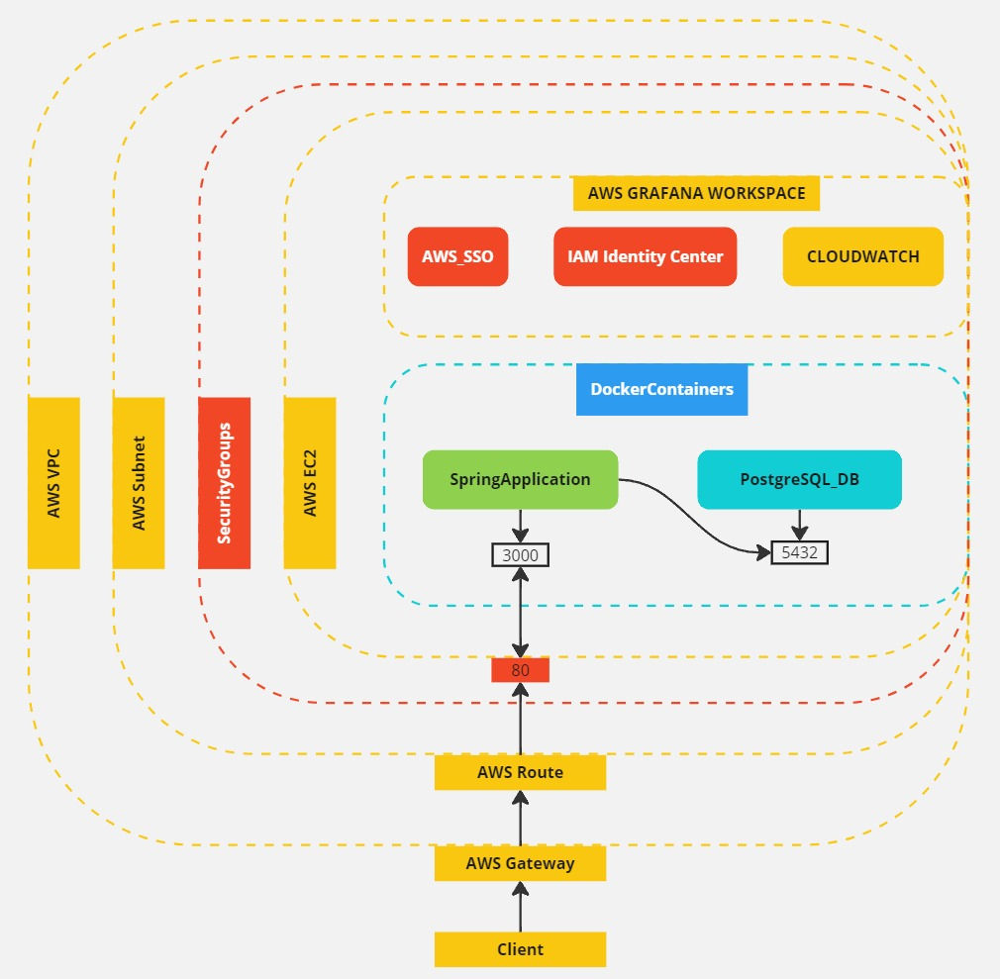

### Especificações do sistema
- OpenAPI - Swagger Ui foi utilizada para o processo de manipulação de dados.
- Postgres foi utilizado como SGBD
- Docker utilizado para conteinerização
- Serviços AWS utilizados: 
  - AWS VPC;
  - AWS SUBNET;
  - AWS EC2;
  - AMAZON MANAGED GRAFANA.
- Terraform utilizado para fazer deploy da aplicação

### Configuração
- Necessário conta na AWS: https://aws.amazon.com/pt/console/
- Necessário criação de um usuário IAM: https://aws.amazon.com/pt/iam/
- Necessário criação de um usuário no IAM Identify Center para o uso do Grafana: https://aws.amazon.com/pt/iam/identity-center/

### Diagrama do projeto
